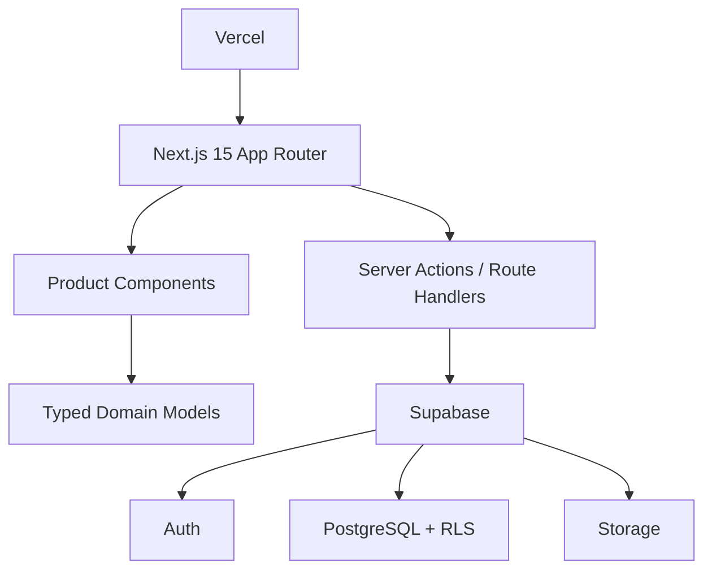

# Family Education Dashboard

[](https://nextjs.org/)
[](https://react.dev/)
[](https://www.typescriptlang.org/)
[](https://supabase.com/)
[](https://tailwindcss.com/)

A calm, mobile-first workspace for parents managing education across multi-child households. Coordinate schedules, track progress, plan goals, and organize resources — all in one place.

> **Status:** MVP pilot with three children. Architecture supports any family size and a future SaaS model.

## The Problem

Parents juggle each child's education across school portals, messaging apps, paper calendars, tutoring notes, and scattered cloud folders. More children = exponentially more chaos.

**Family Education Dashboard** turns that fragmented workflow into a unified family education operating system.

## Product Modules

| Module | What it does |
|--------|-------------|
| **Dashboard** | Weekly overview, upcoming events, study-time metrics, growth summary |
| **Child Management** | Dynamic add/edit/delete profiles, per-child details and switching |
| **Unified Calendar** | School, tutoring, activities, exams, family events in one view |
| **Growth Tracking** | Learning records, study duration, subject performance, monthly reports |
| **Education Roadmap** | Goals, milestones, exam timelines, progress tracking |
| **Resource Center** | Files, notes, worksheets, links, books — tagged by subject |

## Architecture



## Tech Stack

`Next.js 15` `React 19` `TypeScript` `TailwindCSS` `Radix UI` `Lucide Icons` `Supabase` `PostgreSQL` `Vercel`

## Quick Start

```bash
npm install
npm run dev
```

Quality checks:

```bash
npm run lint
npm run typecheck
```

For Supabase integration, create `.env.local`:

```bash
NEXT_PUBLIC_SUPABASE_URL="https://your-project.supabase.co"
NEXT_PUBLIC_SUPABASE_ANON_KEY="your-anon-key"
SUPABASE_SERVICE_ROLE_KEY="server-only-service-role-key"
```

## Data Model

```text
families
  ├── family_members          # user roles & membership
  ├── children                # profiles & school info
  │     ├── calendar_events   # unified event model
  │     ├── learning_records  # study activity & performance
  │     ├── monthly_reports   # per-child monthly summaries
  │     ├── education_goals   # long-term goals
  │     │     └── milestones  # goal milestones
  │     └── resources         # files, notes, links, materials
```

Full schema: [docs/database-schema.sql](./docs/database-schema.sql)

## MVP Status

**Done:**
Mobile-first dashboard, multi-child data model, dynamic child CRUD, weekly overview, unified calendar, growth tracking, education roadmap, resource center, Supabase-ready schema with RLS.

**Next:**
- [ ] Replace mock data with Supabase queries
- [ ] Auth & family membership onboarding
- [ ] Supabase Storage upload flow
- [ ] Deploy to Vercel
- [ ] Test coverage for core workflows

## Roadmap

| Phase | Milestone |
|-------|-----------|
| 1 | Single-family MVP with core dashboard |
| 2 | Authenticated workspace with persistent CRUD |
| 3 | Invitations, caregiver roles, sharing |
| 4 | Subscription billing, calendar sync, reminders |
| 5 | AI-assisted reports & personalized roadmap |

## Design Philosophy

Inspired by Apple Education, Linear, Notion, and Stripe Dashboard — calm hierarchy, dense but readable layouts, mobile-first, minimal friction.

## Documentation

- [Product Architecture](./docs/product-architecture.md)
- [Database Schema](./docs/database-schema.sql)
- [Wireframes](./docs/wireframes.md)

## License

Published as a portfolio MVP. A formal license will be added before external reuse or commercialization.
