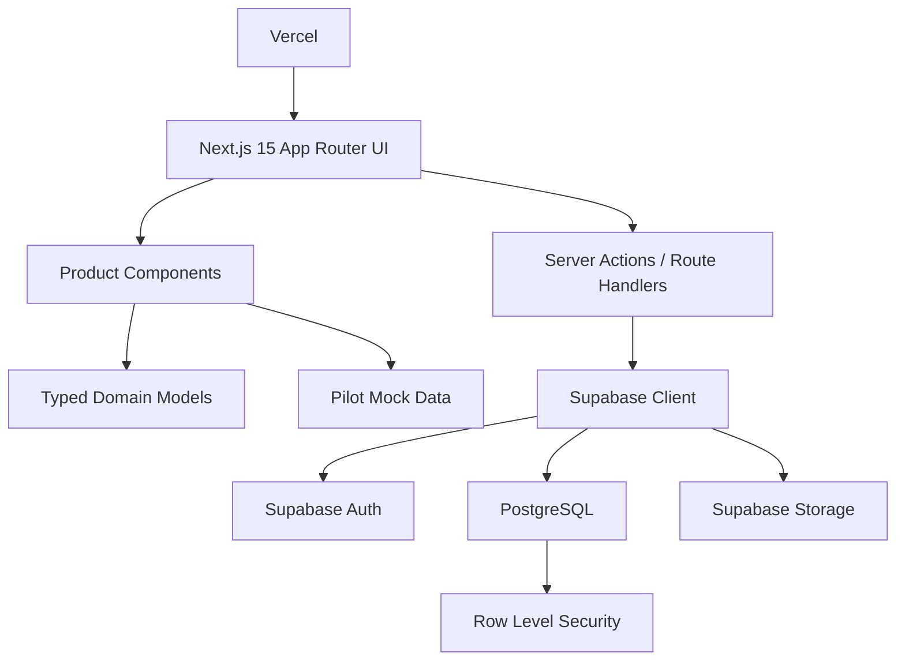

# Family Education Dashboard

Family Education Dashboard is a production-ready MVP for managing education across multi-child households. It helps parents coordinate school schedules, tutoring, extracurricular activities, exams, learning records, educational resources, and long-term planning from one calm, mobile-first workspace.

The current pilot experience is modeled around a family with three children, but the product architecture is designed to support any number of children and a future SaaS workspace model.

## Product Vision

Parents often manage each child's education across disconnected tools: school portals, messaging apps, paper calendars, tutoring notes, worksheets, exam deadlines, and scattered cloud folders. As the number of children grows, the operational burden grows quickly.

Family Education Dashboard turns that fragmented workflow into a unified family education operating system.

## Core Use Cases

- See the whole family's education week at a glance.
- Add, edit, and manage child profiles dynamically.
- Track school, tutoring, activities, exams, and family education events in one calendar.
- Record learning activity, performance signals, and monthly progress.
- Plan goals, milestones, and exam timelines per child.
- Organize files, notes, worksheets, links, and learning materials.
- Prepare the product foundation for authentication, storage, subscriptions, and collaboration.

## Target Users

- Parents and guardians managing education for multiple children.
- Co-parents or caregivers who need shared visibility.
- Future collaborators such as tutors, teachers, or education consultants.
- SaaS customers who need a family workspace instead of a single-child tracker.

## Product Modules

### 1. Family Dashboard

The main dashboard summarizes the full household:

- Weekly overview by event category.
- Upcoming event queue.
- Study-time and goal-progress metrics.
- Growth summary across all children.
- Quick access to child profiles, calendar, roadmap, and resources.

### 2. Child Management

Child management supports dynamic family composition:

- Add, edit, and delete children.
- Switch between child profiles.
- Store grade, school, program, interests, and focus areas.
- Prepare for future per-child permissions and sharing.

### 3. Unified Calendar

The calendar normalizes education-related events into a single structure:

- School events.
- Tutoring sessions.
- Activities and extracurriculars.
- Exams and assessments.
- Family education routines.
- Events can belong to one child, multiple children, or the whole family.

### 4. Growth Tracking

Growth tracking captures both activity and progress:

- Learning records.
- Study duration.
- Subject performance.
- Confidence signals.
- Monthly report structure.
- Future AI-assisted progress summaries.

### 5. Education Roadmap

The roadmap turns long-term education planning into visible milestones:

- Goals by child and subject.
- Target dates.
- Progress percentage.
- Milestones.
- Exam preparation timeline.
- Status model: planned, in progress, achieved, at risk.

### 6. Resource Center

The resource center organizes education materials:

- Files.
- Notes.
- Links.
- Worksheets.
- Books and videos.
- Tags and subject metadata.
- Supabase Storage-ready file metadata.

## Technical Architecture



The MVP currently uses typed mock data for fast product iteration. The repository also includes a Supabase-ready PostgreSQL schema with row-level security policies for the production data layer.

## Tech Stack

- Next.js 15 App Router
- React 19
- TypeScript
- TailwindCSS
- shadcn/ui-style local primitives
- Radix UI primitives
- Lucide React icons
- Supabase client
- PostgreSQL schema
- Vercel deployment target

## Repository Structure

```text
.
├── docs/
│   ├── database-schema.sql
│   ├── product-architecture.md
│   └── wireframes.md
├── src/
│   ├── app/
│   │   ├── globals.css
│   │   ├── layout.tsx
│   │   └── page.tsx
│   ├── components/
│   │   ├── dashboard/
│   │   │   ├── app-shell.tsx
│   │   │   ├── child-management.tsx
│   │   │   ├── child-profile.tsx
│   │   │   ├── education-roadmap.tsx
│   │   │   ├── growth-summary.tsx
│   │   │   ├── metric-card.tsx
│   │   │   ├── resource-center.tsx
│   │   │   ├── unified-calendar.tsx
│   │   │   ├── upcoming-events.tsx
│   │   │   └── weekly-overview.tsx
│   │   └── ui/
│   │       └── shadcn-style reusable UI primitives
│   └── lib/
│       ├── mock-data.ts
│       ├── supabase.ts
│       ├── types.ts
│       └── utils.ts
├── package.json
├── tailwind.config.ts
└── next.config.ts
```

## Data Model

The database schema is designed around family workspaces:

- `families`: top-level workspace.
- `family_members`: user membership and roles.
- `children`: child profiles and school information.
- `calendar_events`: unified event model.
- `calendar_event_children`: many-to-many event assignment.
- `learning_records`: study activity and performance entries.
- `monthly_reports`: report summaries by child and month.
- `education_goals`: long-term goals and roadmap progress.
- `milestones`: goal milestones.
- `resources`: files, notes, links, and learning materials.

See [docs/database-schema.sql](./docs/database-schema.sql) for the full PostgreSQL schema and Supabase RLS policies.

## Current MVP Status

Implemented:

- Mobile-first responsive dashboard.
- Multi-child pilot data model.
- Dynamic child add/edit/delete UI.
- Child profile panel.
- Weekly overview and upcoming events.
- Unified calendar grouped by category.
- Growth tracking summary.
- Education roadmap cards.
- Resource center.
- Product architecture documentation.
- Supabase-ready database schema.
- TypeScript and ESLint validation.

Next production steps:

- Replace mock data with Supabase queries and mutations.
- Add Supabase Auth and family membership onboarding.
- Persist child, event, learning record, goal, and resource CRUD.
- Add Supabase Storage upload flow.
- Deploy to Vercel.
- Add screenshots and product demo media.
- Add test coverage for core user workflows.

## Local Development

Install dependencies:

```bash
npm install
```

Run the development server:

```bash
npm run dev
```

Run quality checks:

```bash
npm run lint
npm run typecheck
```

Create `.env.local` from `.env.example` when wiring Supabase:

```bash
NEXT_PUBLIC_SUPABASE_URL="https://your-project.supabase.co"
NEXT_PUBLIC_SUPABASE_ANON_KEY="your-anon-key"
SUPABASE_SERVICE_ROLE_KEY="server-only-service-role-key"
```

## Build Notes

The application is configured for Next.js 15. On this local machine, the native Next SWC package had a cache issue during verification, so the production build was validated with the official SWC WASM fallback:

```bash
NEXT_TEST_WASM=1 NEXT_TEST_WASM_DIR=/Users/moira/Documents/family/node_modules/@next/swc-wasm-nodejs npm run build
```

In a standard Vercel environment, this workaround should not be necessary.

## Deployment Plan

1. Create a Supabase project.
2. Run `docs/database-schema.sql` in the Supabase SQL editor.
3. Configure Supabase Auth providers.
4. Add environment variables to Vercel.
5. Deploy the Next.js app from GitHub.
6. Enable storage buckets for resource uploads.
7. Add production RLS policy tests before external users are invited.

## Commercialization Path

Phase 1: Single-family MVP with core dashboard workflows.

Phase 2: Authenticated family workspace with persistent CRUD.

Phase 3: Invitations, caregiver roles, child-specific sharing, and storage.

Phase 4: Subscription billing, calendar sync, reminders, and advanced reporting.

Phase 5: AI-assisted monthly reports and personalized education roadmap suggestions.

## Design Direction

The product interface is inspired by Apple Education, Linear, Notion, and Stripe Dashboard:

- Calm information hierarchy.
- Dense but readable operational layout.
- Mobile-first interaction model.
- Soft neutral surfaces with focused accent colors.
- Clear cards for repeatable education objects.
- Minimal friction for parent workflows.

## Documentation

- [Product Architecture](./docs/product-architecture.md)
- [Database Schema](./docs/database-schema.sql)
- [Wireframes](./docs/wireframes.md)

## License

This project is currently published as a portfolio MVP. A formal license can be added before external reuse or commercialization.
