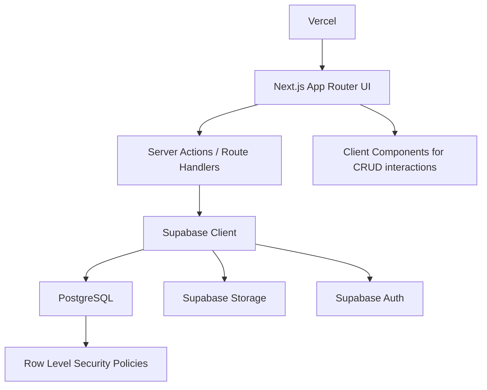

# Product Architecture

## Product

Family Education Dashboard helps parents coordinate education across multiple children: school schedules, tutoring, activities, exams, learning records, resources, and long-term planning.

The MVP starts as a single-family dashboard but uses SaaS-ready boundaries: families, memberships, children, normalized events, goals, reports, resources, and role-aware access.

## Primary Users

- Parent or guardian: owns the family workspace, manages schedules and planning.
- Co-parent or caregiver: can view or contribute depending on role.
- Future tutor or teacher collaborator: limited access to assigned children or records.

## Core Modules

1. Family Dashboard
   - Weekly overview by child and event category.
   - Upcoming event queue.
   - Growth summary across learning, performance, and goals.

2. Child Management
   - Dynamic add, edit, delete children.
   - Profile pages with school, grade, interests, and needs.
   - Child-specific event, record, resource, and roadmap views.

3. Unified Calendar
   - School, tutoring, activities, exams, and family events.
   - Event ownership can be one child, multiple children, or the full family.
   - Recurrence can be added after pilot validation.

4. Growth Tracking
   - Learning records, subject performance, attendance, habits, and monthly reports.
   - Designed to support manual entries first, integrations later.

5. Education Roadmap
   - Goals, milestones, exam timelines, and target dates.
   - Parent-friendly status model: planned, in progress, achieved, at risk.

6. Resource Center
   - Files, notes, links, worksheets, school documents, and learning materials.
   - Supabase Storage-ready file metadata.

## Architecture Diagram



## Application Layers

- `src/app`: route segments, layout, metadata, and page composition.
- `src/components/dashboard`: product-specific dashboard modules.
- `src/components/ui`: shadcn/ui-style reusable primitives.
- `src/lib`: typed mock data, utility functions, Supabase client, and domain types.
- `docs`: architecture, wireframes, and SQL schema.

## Folder Structure

```text
family-education-dashboard/
  docs/
    database-schema.sql
    product-architecture.md
    wireframes.md
  src/
    app/
      globals.css
      layout.tsx
      page.tsx
    components/
      dashboard/
        app-shell.tsx
        child-management.tsx
        child-profile.tsx
        education-roadmap.tsx
        growth-summary.tsx
        metric-card.tsx
        resource-center.tsx
        unified-calendar.tsx
        upcoming-events.tsx
        weekly-overview.tsx
      ui/
        avatar.tsx
        badge.tsx
        button.tsx
        card.tsx
        dialog.tsx
        input.tsx
        label.tsx
        progress.tsx
        select.tsx
        separator.tsx
        tabs.tsx
        textarea.tsx
    lib/
      mock-data.ts
      supabase.ts
      types.ts
      utils.ts
```

## SaaS Commercialization Path

- Phase 1: single-family MVP with Supabase Auth and RLS.
- Phase 2: invitations, role permissions, child-specific sharing, storage uploads.
- Phase 3: paid workspaces, analytics, reminders, calendar sync, and school/tutor integrations.
- Phase 4: AI-assisted monthly reports and personalized roadmap suggestions.

## Security Model

- Each table belongs to a `family_id` either directly or through child ownership.
- Users join families through `family_members`.
- RLS policies limit access to authenticated members of the family.
- Storage objects should be organized by family and resource id.

## Deployment

- Host on Vercel.
- Connect environment variables from Supabase.
- Run `docs/database-schema.sql` in Supabase SQL editor.
- Enable Supabase Auth providers before inviting family members.
